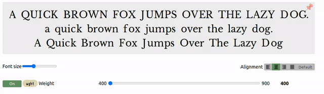

----

# BlockBone Serif to Blackletter Variable Font

 BlockBone is a variable font transitioning leters from Serif style to Blacletter style with increase in weight. It will be usefull for web animation. 

## About

 This font is created by Dr Anirban Mitra, an amateur tyographer and free software enthusiast

## Building

The proof files and QA tests are also available automatically via GitHub Actions - look at https://mitradranirban.github.io/blockbone.git.

## Changelog

 **21 November 2024. Version 0.001**
- Font Project Created

 **23 April 2025. Version 0.500**
 - Completed GF Latin  Core character set

## License

This Font Software is licensed under the SIL Open Font License, Version 1.1.
This license is available with a FAQ at [Open Font Licence site](https://openfontlicense.org)

## Repository Layout

This font repository structure is inspired by [Unified Font Repository v0.3](https://github.com/unified-font-repository/Unified-Font-Repository), modified for the Google Fonts workflow.
